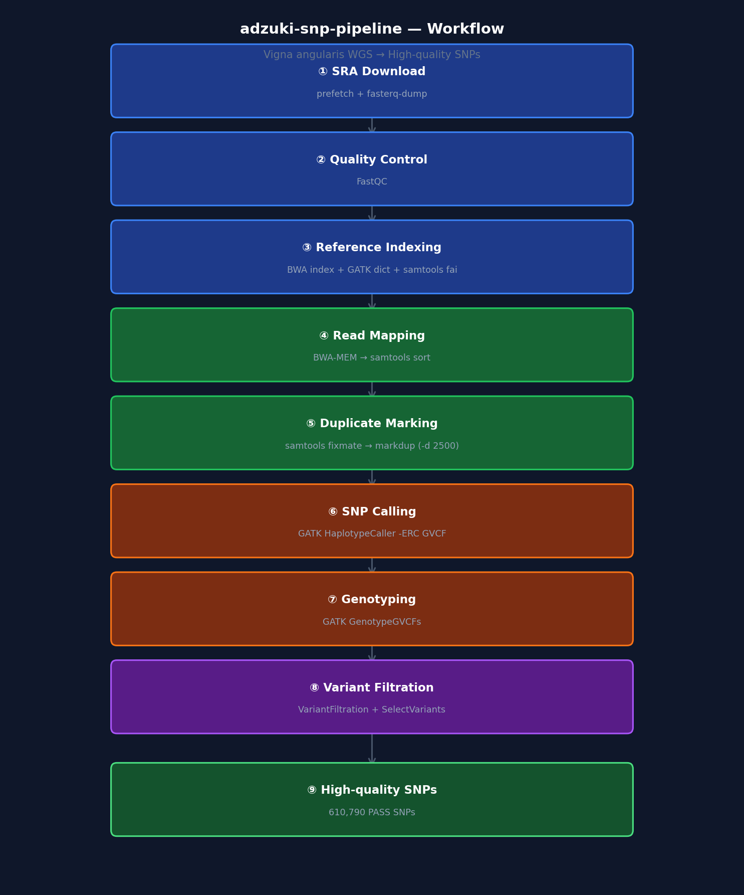
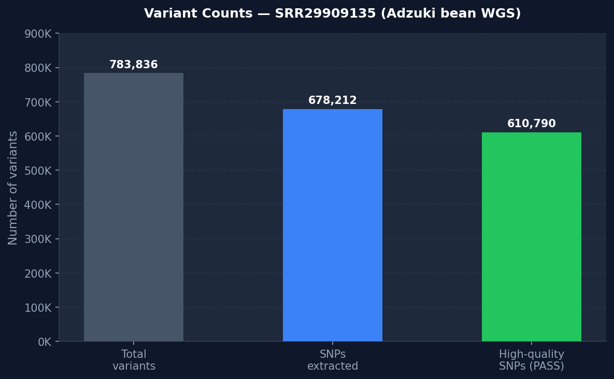
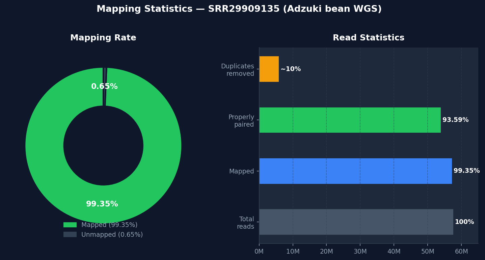

# adzuki-snp-pipeline

Reproducible SNP calling pipeline for adzuki bean (*Vigna angularis*) using public WGS datasets.

## Background

This repository originated from my work in adzuki bean genetics and breeding research.

While public WGS datasets for adzuki bean have recently become available (PRJNA1138464, Science 2025), reproducible pipelines for SNP discovery remain limited.

The goal of this project is to provide an open and reproducible foundation for genomic analyses in adzuki bean, including:

- SNP calling from public WGS resequencing data
- GWAS and QTL analysis
- SNP panel design for genomic selection (GS)

## Data Source

| Item | Detail |
|---|---|
| BioProject | [PRJNA1138464](https://www.ncbi.nlm.nih.gov/bioproject/PRJNA1138464) |
| Publication | Chien et al. 2025, *Science* 388: eads2871 |
| Data type | WGS resequencing (327 accessions) + DArT-seq (357 accessions) |
| Reference genome | *Vigna angularis* GCF_016808095.1 (ASM1680809v1) |

## Pipeline Overview



## Environment

```bash
conda create -n bioinfo -c conda-forge -c bioconda \
  fastqc sra-tools bwa samtools gatk4 bcftools ncbi-datasets-cli -y
conda activate bioinfo
```

## Example Output



| Step | Count | Note |
|---|---|---|
| Total reads | 57,597,756 | Paired-end, 150 bp |
| Mapping rate | **99.35%** | BWA-MEM to GCF_016808095.1 |
| Properly paired | 93.59% | |
| Duplicate rate | ~10% | HiSeq X patterned flow cell |
| Total variants | 783,836 | SNP + indel |
| SNPs extracted | 678,212 | After SelectVariants |
| High-quality SNPs | **610,790** | After hard filtering (PASS) |



## Notes on Adzuki Bean Genomics

- **RAD-seq is not recommended** for adzuki bean. The genome (~540 Mb) contains abundant repetitive sequences. Low-coverage WGS is strongly preferred.
- For multi-sample GS panel construction, Joint Genotyping is strongly recommended over per-sample VCF merging.

## Related Repositories

- [adzuki-gwas-analysis](https://github.com/hoso-jpn/adzuki-gwas-analysis) *(in progress)*
- [genomic-prediction-benchmark](https://github.com/hoso-jpn/genomic-prediction-benchmark) *(in progress)*
- [genomic-prediction-resnet-hybrid](https://github.com/hoso-jpn/genomic-prediction-resnet-hybrid)

## Author

**Hoso**

Founder, [Florigen AI](https://florigen.ai)
Plant Genetics × Bioinformatics × Physical AI

- GitHub: [@hoso-jpn](https://github.com/hoso-jpn)
- Researchmap: [hosokawa-yusuke](https://researchmap.jp/hosokawa-yusuke)

## License

MIT License
