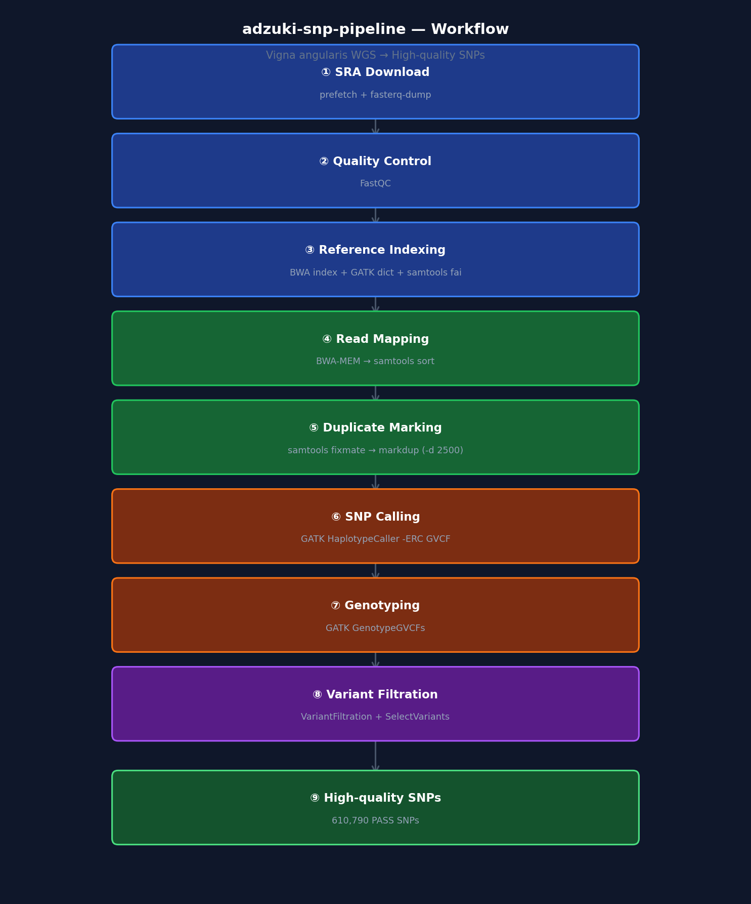
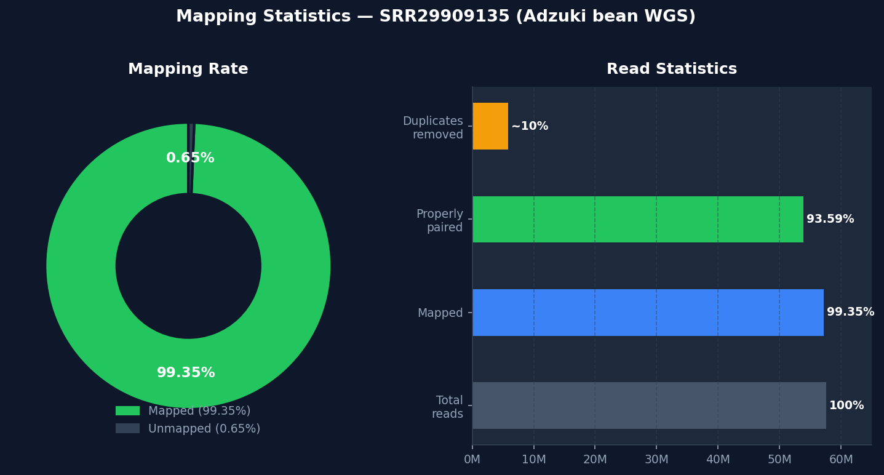
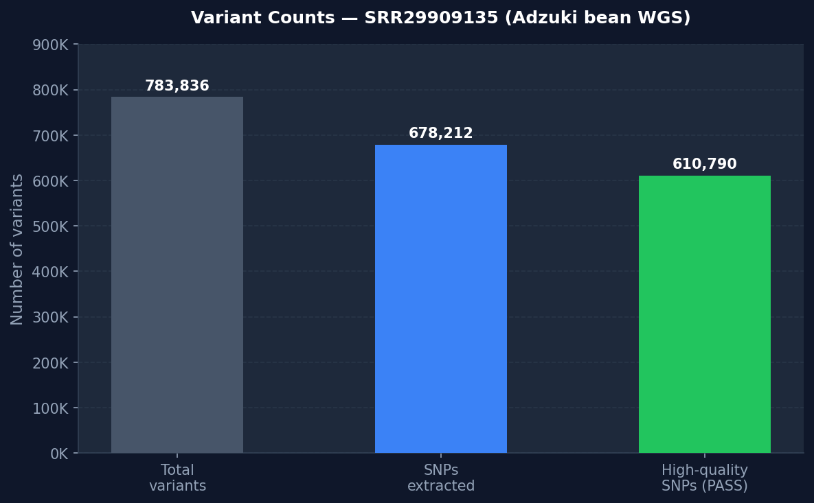
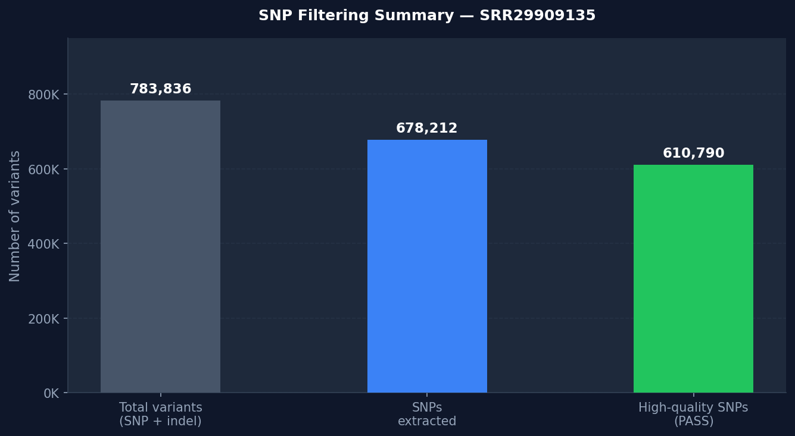

# adzuki-snp-pipeline

Research and development repository for building a reproducible SNP-calling pipeline for adzuki bean (*Vigna angularis*) from publicly available whole-genome sequencing data.

The repository contains an executable Nextflow DSL2 workflow for paired-end WGS preprocessing, sample-level GVCF generation, multi-sample Joint Genotyping, configurable hard filtering, PASS extraction, and variant QC, together with a historical, manually executed single-sample SNP-calling pilot. MultiQC aggregation, automated pipeline tests, and real-data cohort validation remain under development and are tracked in [Issue #1](https://github.com/hoso-jpn/adzuki-snp-pipeline/issues/1).

This work represents plant-genetics and bioinformatics research that informs the longer-term agricultural AI activities of Florigen AI. It does not imply a direct genomic-prediction-to-Physical-AI development path.

---

## Current Maturity

| Capability | Status | Evidence or limitation |
| --- | --- | --- |
| Manual single-sample SNP-calling pilot | Executed once | SRR29909135 was processed manually; the result has not yet been reproduced by an automated test |
| Documented command sequence | Available | Commands are recorded below, but software versions and execution parameters are not yet fully locked |
| Nextflow DSL2 workflow | Implemented through filtered cohort VCFs and variant QC | Strict-syntax-compatible preprocessing, mapping, duplicate marking, GVCF generation, Joint Genotyping, hard filtering, PASS extraction, and QC processes are available |
| Variant calling and genotyping | Functionally validated with synthetic data | HaplotypeCaller, contig-level GenomicsDBImport and GenotypeGVCFs, and reference-order GatherVcfs are connected |
| Variant filtering and QC | Functionally validated with synthetic data | SNPs and indels are separated, configurable hard filters are applied, PASS records are extracted, and raw, filtered, and PASS QC artifacts are generated; threshold suitability remains unvalidated on real cohorts |
| Configurable reference bundle | Implemented | The workflow accepts compatible prebuilt indexes or generates FASTA, sequence-dictionary, and BWA-MEM2 indexes |
| Multi-sample Joint Genotyping | Functionally validated with synthetic data | Two samples and two contigs complete GenomicsDBImport-based Joint Genotyping; real-data cohorts remain unvalidated |
| Read preprocessing and QC | Implemented without MultiQC | Raw and trimmed FastQC, paired-end fastp, mapping logs, duplicate metrics, and SAMtools QC are produced |
| Pipeline-level tests | Partially implemented | A clean synthetic Docker smoke test validates three read groups, two sample GVCFs, two expected raw SNPs, hard-filter annotations, indexed PASS outputs, seven variant-QC tasks, and 28 QC artifacts; nf-test automation remains planned |
| Functional CI | Not implemented | Current CI checks repository structure only |
| Base quality score recalibration (BQSR) | Intentionally excluded | No validated known-sites resource is available; see [Design Decisions](#design-decisions) |
| Production use | Not supported | This is an experimental plant-research repository |

The figures and large-scale variant counts in this README remain historical results from the single-sample pilot and have not been reproduced by the executable workflow. The synthetic workflow path has separately completed a clean Docker smoke test with deterministic expected variants.

---

## Data and Reference Sources

### Sequencing data

| Item | Detail |
| --- | --- |
| BioProject | [PRJNA1138464](https://www.ncbi.nlm.nih.gov/bioproject/PRJNA1138464) |
| Demonstration accession | SRR29909135 |
| Associated publication | [Chien et al. 2025, *Science* 388: eads2871](https://doi.org/10.1126/science.ads2871) |
| Public data described by the study | WGS resequencing of 327 accessions and DArT-seq data from 357 accessions |
| Scope validated in this repository | One WGS accession only |

The associated study also reports DArT-seq data from 357 accessions. The current and planned variant-calling scope of this repository is WGS; no RAD-seq or DArT-seq workflow is implemented or evaluated here.

### Reference genome

The manual pilot used the following independent reference assembly:

| Item | Detail |
| --- | --- |
| Accession | [GCF_016808095.1](https://www.ncbi.nlm.nih.gov/datasets/genome/GCF_016808095.1/) |
| Assembly | ASM1680809v1 |
| Cultivar | Longxiaodou 4 |
| Assembly span | 447.8 Mb |
| Publication | [Li et al. 2024, *Scientific Data* 11:1074](https://doi.org/10.1038/s41597-024-03911-y) |

The approximately 540 Mb figure often cited for adzuki bean is a k-mer-based genome-size estimate for the cultivar Shumari ([Sakai et al. 2015, *Scientific Reports* 5:16780](https://doi.org/10.1038/srep16780)). For Longxiaodou 4, Li et al. estimated a genome size of 464.9 Mb by 21-mer analysis; the 447.8 Mb assembly represents 96.32% of that estimate. These values differ by cultivar and estimation method and should not be treated as interchangeable.

The sequencing data and reference assembly originate from different studies and genetic backgrounds. The executable workflow treats the reference genome as an explicit, configurable analysis input; results produced against different references must not be assumed to be interchangeable.

---

## Nextflow WGS Variant-Calling Workflow

Issues [#4](https://github.com/hoso-jpn/adzuki-snp-pipeline/issues/4), [#6](https://github.com/hoso-jpn/adzuki-snp-pipeline/issues/6), [#9](https://github.com/hoso-jpn/adzuki-snp-pipeline/issues/9), and [#13](https://github.com/hoso-jpn/adzuki-snp-pipeline/issues/13) establish the input contracts and executable workflow from paired-end WGS reads through filtered cohort VCFs and variant QC.

The current workflow performs the following actions:

- validates pipeline parameters with `nf-schema` 2.8.0
- validates samplesheet structure, required values, paths, and read-group uniqueness
- rejects identical read 1/read 2 paths and FASTQ files reused across read groups
- permits multiple read groups and sequencing lanes for one biological sample
- runs FastQC before and after paired-end fastp trimming
- generates or accepts compatible FASTA, sequence-dictionary, and BWA-MEM2 indexes
- maps each read group independently with BWA-MEM2 and preserves `ID`, `SM`, `LB`, `PL`, and optional `PU` metadata
- coordinate-sorts each read group and merges read groups by biological sample
- marks library-aware duplicates with GATK MarkDuplicates without removing duplicate records
- creates BAM indexes and SAMtools flagstat, stats, and idxstats reports
- generates one indexed GVCF per biological sample with GATK HaplotypeCaller
- creates one GenomicsDB workspace per reference contig and jointly genotypes all sample GVCFs
- gathers contig-level raw VCFs in reference-index order and creates an indexed raw cohort VCF
- separates the cohort VCF into indexed SNP and indel VCFs
- applies configurable SNP- and indel-specific hard filters with GATK VariantFiltration
- extracts indexed PASS-only SNP and indel VCFs
- runs `bcftools stats` for raw, filtered, and PASS stages and produces machine-readable cohort and per-sample QC tables plus human-readable summaries
- provides a redistributable synthetic functional-test dataset with deterministic expected SNPs

It does **not** yet run MultiQC, automated nf-test coverage, genomic-selection panel generation, or real-data cohort validation.

### Requirements

- Bash 3.2 or later
- Java 17 or later
- Nextflow 26.04.6
- Docker for containerized process execution

Nextflow 26.04 and later use the strict syntax parser by default. The tested version can be selected without changing the globally installed launcher:

```bash
NXF_VER=26.04.6 nextflow -version
```

The first run may download the pinned `nf-schema` plugin. The synthetic FASTQ and reference fixtures themselves are stored in this repository.

Process containers are pinned by both image tag and manifest digest in the local modules. The BioConda BWA-MEM2 image is tagged as version 2.3, while its bundled executable reports version 2.2.1 because the upstream 2.3 release retained the earlier internal version string. See the [BioConda recipe](https://github.com/bioconda/bioconda-recipes/blob/master/recipes/bwa-mem2/meta.yaml) and [upstream issue #283](https://github.com/bwa-mem2/bwa-mem2/issues/283).

### Validate and run the workflow

The pinned containers currently target Linux AMD64. Use `docker` on native Linux AMD64 or `docker_amd64` for functional testing through Docker emulation on Apple Silicon. The emulated profile is not intended for performance benchmarking.

```bash
NXF_VER=26.04.6 nextflow lint .

NXF_VER=26.04.6 \
  nextflow run . \
  -profile test,docker
```

On Apple Silicon:

```bash
NXF_VER=26.04.6 \
  nextflow run . \
  -profile test,docker_amd64
```

The synthetic dataset contains two 5 kb contigs, two biological samples, and three read groups. The two `sample_a` read groups share `library_id=lib_a` and contain intentional cross-lane duplicate fragments. A successful run retains all 24 `sample_a` reads while marking four reads as duplicates; the 12 `sample_b` reads contain no intended duplicates.

The fixtures also encode deterministic SNPs at `chrSynthetic1:1501 C>G` for `sample_a` and `chrSynthetic2:1601 A>C` for `sample_b`. The expected alleles are recorded in `tests/data/variants/expected_variants.tsv`. A clean Docker smoke run produces both raw SNPs with the expected sample columns and non-reference genotypes.

With the default `snp_filter_sor_max=3.0`, both synthetic SNPs receive the `SNP_SOR_HIGH` filter because their SOR values are greater than 3.0. The resulting default PASS SNP VCF is therefore valid but empty. A separate permissive smoke run with `--snp_filter_sor_max 10.0` retains both SNPs as PASS. This behavior validates filter labeling, PASS extraction, and empty-VCF handling; it is not evidence that either threshold is biologically appropriate.

These fixtures test workflow behavior, read-group-aware duplicate marking, GVCF generation, Joint Genotyping, hard-filter mechanics, and variant-QC generation. They do not constitute biological or production validation. The current fixture also has one missing sample genotype at each variant locus; stronger reference-versus-alternate genotype coverage is tracked in [Issue #12](https://github.com/hoso-jpn/adzuki-snp-pipeline/issues/12).

The deterministic fixtures can be regenerated with:

```bash
python3 tests/scripts/generate_synthetic_data.py
```

### Variant outputs

| Output | Description |
| --- | --- |
| `variants/gvcf/<sample_id>.g.vcf.gz` | Sample-level GVCF generated by HaplotypeCaller |
| `variants/gvcf/<sample_id>.g.vcf.gz.tbi` | Tabix index for the sample GVCF |
| `variants/raw/cohort.raw.vcf.gz` | Unfiltered multi-sample cohort VCF gathered in reference-contig order |
| `variants/raw/cohort.raw.vcf.gz.tbi` | Tabix index for the raw cohort VCF |
| `variants/by_type/cohort.snp.vcf.gz` | Raw cohort records selected as SNPs |
| `variants/by_type/cohort.indel.vcf.gz` | Raw cohort records selected as indels |
| `variants/filtered/cohort.<snp-or-indel>.filtered.vcf.gz` | Variant-type VCF with hard-filter labels applied |
| `variants/pass/cohort.<snp-or-indel>.pass.vcf.gz` | Records whose FILTER value passes all configured hard filters |
| `qc/variants/cohort.<stage>.<type>.bcftools.stats.tsv` | Complete `bcftools stats` output |
| `qc/variants/cohort.<stage>.<type>.variant_qc.tsv` | Machine-readable cohort and variant-level QC metrics |
| `qc/variants/cohort.<stage>.<type>.sample_qc.tsv` | Machine-readable per-sample genotype and missingness metrics |
| `qc/variants/cohort.<stage>.<type>.summary.txt` | Human-readable QC summary |

Every compressed VCF listed above is accompanied by a `.tbi` index. Variant QC is generated for seven stage/type combinations: `raw/all`, `raw/snp`, `raw/indel`, `filtered/snp`, `filtered/indel`, `pass/snp`, and `pass/indel`.

The cohort QC table reports sample and record counts, variant-type counts, multiallelic-site counts, transitions, transversions, Ti/Tv, cohort missing-genotype counts and rates, and the sample list. The per-sample table reports reference-homozygous, non-reference-homozygous, heterozygous, and missing genotype counts, missingness rate, average depth, and singleton count.

The raw, filtered, and PASS VCFs remain intermediate scientific results. The presence of a PASS label means only that a record passed the configured rules; it must not be interpreted as an analysis-ready SNP panel or as evidence that the thresholds are suitable for a biological cohort.

### Samplesheet contract

The input must be a CSV file.

| Column | Required | Description |
| --- | --- | --- |
| `sample_id` | Yes | Biological sample identifier; repeated values are allowed for multiple read groups |
| `read_group_id` | Yes | Identifier that must be unique across the samplesheet |
| `fastq_1` | Yes | Existing read 1 file ending in `.fq.gz` or `.fastq.gz` |
| `fastq_2` | Yes | Existing read 2 file ending in `.fq.gz` or `.fastq.gz` |
| `library_id` | Yes | Sequencing library identifier |
| `platform` | Yes | Sequencing platform; the initial contract accepts `ILLUMINA` |
| `platform_unit` | No | Flowcell, lane, and sample-barcode identifier |

When supplied, `platform_unit` should distinguish read groups using a value such as `FLOWCELL.LANE.SAMPLE_BARCODE`. It should not be reused across distinct read groups.

Example:

```csv
sample_id,read_group_id,fastq_1,fastq_2,library_id,platform,platform_unit
sample_a,sample_a_L001,reads/a_L001_R1.fastq.gz,reads/a_L001_R2.fastq.gz,lib_a,ILLUMINA,flowcell1.L001.ATCACG
sample_a,sample_a_L002,reads/a_L002_R1.fastq.gz,reads/a_L002_R2.fastq.gz,lib_a,ILLUMINA,flowcell1.L002.ATCACG
```

Unexpected columns, duplicate `read_group_id` values, missing files, identical read 1/read 2 paths, and FASTQ files reused across read groups are rejected before analysis processes start.

### Reference bundle contract

The following parameters define the reference bundle.

| Parameter | Required | Description |
| --- | --- | --- |
| `reference_id` | Yes | Stable identifier for the reference bundle |
| `reference_name` | Yes | Human-readable assembly name |
| `reference_fasta` | Yes | Existing uncompressed reference FASTA |
| `reference_accession` | No | Public database accession |
| `reference_species` | No | Species represented by the reference |
| `reference_cultivar` | No | Cultivar represented by the reference |
| `reference_fai` | No | Compatible prebuilt FASTA index named `<reference_fasta>.fai` |
| `reference_dict` | No | Compatible prebuilt sequence dictionary named `<reference_basename>.dict` |
| `bwa_index_prefix` | No | Compatible prebuilt BWA-MEM2 index prefix whose basename matches `reference_fasta` |

The synthetic test settings are defined in `conf/test.config`. An example for Longxiaodou 4 is provided in `conf/references/longxiaodou4.config.example`.

When an optional index parameter is omitted, the workflow generates the corresponding index with SAMtools, GATK, or BWA-MEM2. When supplied, index paths and expected filenames are validated before process execution.

### Variant-calling and filtering parameters

| Parameter | Default | Description |
| --- | ---: | --- |
| `sample_ploidy` | `2` | Positive integer passed to HaplotypeCaller as the expected sample ploidy |
| `snp_filter_qd_min` | `2.0` | Mark SNPs with `QD` below this value as `SNP_QD_LOW` |
| `snp_filter_qual_min` | `30.0` | Mark SNPs with `QUAL` below this value as `SNP_QUAL_LOW` |
| `snp_filter_sor_max` | `3.0` | Mark SNPs with `SOR` above this value as `SNP_SOR_HIGH` |
| `snp_filter_fs_max` | `60.0` | Mark SNPs with `FS` above this value as `SNP_FS_HIGH` |
| `snp_filter_mq_min` | `40.0` | Mark SNPs with `MQ` below this value as `SNP_MQ_LOW` |
| `snp_filter_mq_rank_sum_min` | `-12.5` | Mark SNPs with `MQRankSum` below this value as `SNP_MQRANKSUM_LOW` |
| `snp_filter_read_pos_rank_sum_min` | `-8.0` | Mark SNPs with `ReadPosRankSum` below this value as `SNP_READPOSRANKSUM_LOW` |
| `indel_filter_qd_min` | `2.0` | Mark indels with `QD` below this value as `INDEL_QD_LOW` |
| `indel_filter_qual_min` | `30.0` | Mark indels with `QUAL` below this value as `INDEL_QUAL_LOW` |
| `indel_filter_fs_max` | `200.0` | Mark indels with `FS` above this value as `INDEL_FS_HIGH` |
| `indel_filter_read_pos_rank_sum_min` | `-20.0` | Mark indels with `ReadPosRankSum` below this value as `INDEL_READPOSRANKSUM_LOW` |

Ploidy is applied consistently to every biological sample in one pipeline run. Mixed-ploidy cohorts are not currently supported.

The filtering defaults are configurable operational starting points. They extend the historical pilot rules with QUAL, SOR, and indel-specific filters, but their suitability across references, accessions, sequencing depths, and cohort sizes has not been validated. Changing a threshold changes the scientific output and should be recorded with the run parameters.

### Workflow layout

```text
main.nf
nextflow.config
nextflow_schema.json
assets/schema_input.json
conf/test.config
conf/references/
workflows/
subworkflows/local/
modules/local/
tests/data/
```

---

## Pilot Workflow



The following commands document the historical single-sample pilot. They are retained as technical evidence and historical context for the executable Nextflow implementation.

They are **not yet a clean-environment reproduction procedure** because dependency versions, checksums, resource requirements, and all intermediate validation steps have not been fixed.

For readability and shell correctness, the recorded commands have been lightly edited to add output-directory creation, quote the reference path, and correct the long-option spelling for `--native-pair-hmm-threads`. These edits do not indicate that the complete procedure was rerun for this documentation update.

---

## Historical Environment Setup

```bash
conda create -n bioinfo -c conda-forge -c bioconda \
  fastqc sra-tools bwa samtools gatk4 bcftools ncbi-datasets-cli -y
conda activate bioinfo
```

---

## Historical Single-Sample Procedure

### 1. Download the reference genome

```bash
datasets download genome accession GCF_016808095.1 \
  --include genome \
  --filename adzuki_reference.zip

unzip adzuki_reference.zip -d adzuki_reference

REF=adzuki_reference/ncbi_dataset/data/GCF_016808095.1/GCF_016808095.1_ASM1680809v1_genomic.fna
```

### 2. Index the reference genome

```bash
bwa index "$REF"
gatk CreateSequenceDictionary -R "$REF"
samtools faidx "$REF"
```

### 3. Download the demonstration WGS data

```bash
prefetch SRR29909135 --output-directory ./raw_data

fasterq-dump ./raw_data/SRR29909135/SRR29909135.sra \
  --outdir ./raw_data \
  --threads 4 \
  --progress
```

### 4. Perform initial quality control

```bash
mkdir -p fastqc_results

fastqc \
  ./raw_data/SRR29909135_1.fastq \
  ./raw_data/SRR29909135_2.fastq \
  --outdir ./fastqc_results \
  --threads 4
```

This historical procedure performs inspection with FastQC but does not perform read trimming. The executable Nextflow workflow now performs paired-end fastp trimming and FastQC before and after trimming.

### 5. Map reads

```bash
bwa mem -t 4 \
  -R "@RG\tID:SRR29909135\tSM:SRR29909135\tPL:ILLUMINA" \
  "$REF" \
  ./raw_data/SRR29909135_1.fastq \
  ./raw_data/SRR29909135_2.fastq \
  | samtools sort -@ 4 -o SRR29909135.bam

samtools index SRR29909135.bam
```

### 6. Remove duplicates in the historical pilot

The historical command used `samtools markdup -r -d 2500`. The `-r` option removed duplicate reads rather than only setting the duplicate flag. This irreversible behavior is retained here solely as a record of the pilot procedure. The executable Nextflow workflow instead uses GATK MarkDuplicates with `REMOVE_DUPLICATES=false`, preserving duplicate records with the DUP flag so downstream tools can exclude them without destroying the original evidence.

```bash
samtools sort -n -@ 4 \
  SRR29909135.bam \
  -o SRR29909135.namesort.bam

samtools fixmate -m \
  SRR29909135.namesort.bam \
  SRR29909135.fixmate.bam

samtools sort -@ 4 \
  SRR29909135.fixmate.bam \
  -o SRR29909135.fixmate.sort.bam

samtools markdup -r -d 2500 -@ 4 \
  SRR29909135.fixmate.sort.bam \
  SRR29909135.markdup.bam

samtools index SRR29909135.markdup.bam
```

### 7. Call variants in GVCF mode

```bash
gatk HaplotypeCaller \
  -R "$REF" \
  -I SRR29909135.markdup.bam \
  -O SRR29909135.g.vcf.gz \
  -ERC GVCF \
  --tmp-dir /tmp \
  --native-pair-hmm-threads 4
```

### 8. Genotype the demonstration sample

```bash
gatk GenotypeGVCFs \
  -R "$REF" \
  -V SRR29909135.g.vcf.gz \
  -O SRR29909135.vcf.gz
```

This command was used only for the single-sample pilot. The executable multi-sample pipeline uses HaplotypeCaller GVCFs followed by GenomicsDBImport and GenotypeGVCFs for Joint Genotyping. Joint Genotyping is the default for a multi-sample cohort rather than being conditional on a 30-sample threshold.

### 9. Select and filter SNPs

```bash
gatk SelectVariants \
  -V SRR29909135.vcf.gz \
  --select-type-to-include SNP \
  -O SRR29909135.snp.vcf.gz

gatk VariantFiltration \
  -V SRR29909135.snp.vcf.gz \
  --filter-expression "QD < 2.0" \
  --filter-name "QD2" \
  --filter-expression "FS > 60.0" \
  --filter-name "FS60" \
  --filter-expression "MQ < 40.0" \
  --filter-name "MQ40" \
  --filter-expression "MQRankSum < -12.5" \
  --filter-name "MQRankSum-12.5" \
  --filter-expression "ReadPosRankSum < -8.0" \
  --filter-name "ReadPosRankSum-8" \
  -O SRR29909135.snp.filtered.vcf.gz

gatk SelectVariants \
  -V SRR29909135.snp.filtered.vcf.gz \
  --exclude-filtered \
  -O SRR29909135.snp.pass.vcf.gz
```

The hard-filter thresholds above document the historical pilot. Their suitability across references, accessions, and cohort sizes has not yet been validated.

---

## Design Decisions

### Base quality score recalibration (BQSR)

BQSR is intentionally excluded from both the documented historical procedure and the executable workflow. GATK BaseRecalibrator uses a known-sites VCF to distinguish known polymorphisms from mismatches used to model sequencing errors. This repository has not identified or validated an appropriate known-sites resource for the Longxiaodou 4 reference bundle.

Bootstrapped BQSR is also outside the current scope because its known-sites construction and effect on the resulting calls have not been validated here. This is a deliberate design decision rather than an omitted implementation step. See the [GATK BaseRecalibrator documentation](https://gatk.broadinstitute.org/hc/en-us/articles/360036898312-BaseRecalibrator).

### Reference bundle policy

The reference assembly is an explicit pipeline input. Results generated against different cultivars or assemblies must not be treated as directly interchangeable without separate validation. Longxiaodou 4 is retained as a documented real-data example, while the test profile uses a small synthetic reference that is safe to redistribute.

---

## Single-Sample Pilot Results



| Step | Count | Note |
| --- | ---: | --- |
| Total reads | 57,597,756 | Paired-end, 150 bp |
| Mapping rate | 99.35% | BWA-MEM against GCF_016808095.1 |
| Properly paired | 93.59% | Single-sample pilot |
| Duplicate rate | ~10% | Historical run |
| Total variants | 783,836 | SNPs and indels |
| SNPs extracted | 678,212 | After SelectVariants |
| PASS SNPs | 610,790 | After the documented hard filters |





These values describe one historical execution for SRR29909135. They are not estimates for the complete 327-accession cohort and do not demonstrate SNP-calling accuracy or superiority over another workflow.

---

## Implementation Roadmap

The implementation roadmap is tracked in [Issue #1](https://github.com/hoso-jpn/adzuki-snp-pipeline/issues/1).

The following foundation, analysis, and QC capabilities are implemented:

- Nextflow DSL2 workflow compatible with the strict syntax parser
- parameter and samplesheet validation
- configurable reference bundles with index generation or reuse
- raw and trimmed FastQC plus paired-end fastp trimming
- read-group-aware BWA-MEM2 mapping and coordinate sorting
- sample-level read-group merging
- library-aware GATK duplicate marking without removing duplicate records
- BAM indexing and SAMtools flagstat, stats, and idxstats reports
- sample-level GATK HaplotypeCaller GVCF generation
- contig-level GenomicsDBImport and GenotypeGVCFs
- reference-order gathering into an indexed raw cohort VCF
- SNP and indel separation with indexed variant-type outputs
- configurable GATK hard filtering and indexed PASS-only outputs
- raw, filtered, and PASS `bcftools stats` QC
- machine-readable cohort and per-sample QC tables
- human-readable variant-QC summaries
- redistributable deterministic fixtures and a functional Docker smoke-test profile

The following analysis and reproducibility capabilities remain planned:

- MultiQC report aggregation
- documented GS-panel output contracts
- nf-test coverage and functional CI
- software-version, parameter, and checksum manifests

A capability is considered implemented only after its corresponding code and validation are present in this repository.

---

## Data Handling Policy

This public repository is limited to:

- workflow and pipeline source code
- commands and configuration required for reproducibility
- analyses based on publicly available datasets
- synthetic or redistributable test data
- technical validation records that contain no confidential information

The following are not included:

- former-employer or other non-public research data
- customer data
- proprietary SNP panels or marker selections
- confidential business logic
- credentials, access tokens, or private infrastructure details
- material intended to remain protected as future intellectual property

Raw WGS data and full reference bundles are not committed to this repository. They must be obtained from their authoritative public sources.

---

## Related Repositories

The following repositories represent distinct stages of a longer-term research stack. They are not yet connected by an automated end-to-end workflow.

- [adzuki-snp-pipeline](https://github.com/hoso-jpn/adzuki-snp-pipeline) — public WGS data to cohort variants and SNP matrices; currently under reconstruction
- [adzuki-gwas-analysis](https://github.com/hoso-jpn/adzuki-gwas-analysis) — analysis of publicly available GWAS summary statistics
- [genomic-prediction-resnet-hybrid](https://github.com/hoso-jpn/genomic-prediction-resnet-hybrid) — auditable comparison of GBLUP and neural genomic-prediction models using compatible individual-level data

The public Dryad dataset currently used by `adzuki-gwas-analysis` does not contain individual-level genotypes and phenotypes. Therefore, these three repositories should not be read as an already-operational SNP-to-GWAS-to-genomic-prediction service.

---

## Author

**Yusuke Hosokawa**<br>
Independent researcher and AI engineer<br>
Building [Florigen AI](https://florigen.ai), a long-term agricultural AI initiative

Plant Genetics × Edge AI × Physical AI

- [GitHub](https://github.com/hoso-jpn)
- [researchmap](https://researchmap.jp/hosokawa-yusuke)
- [Breeding Science (2025) — QTL mapping in rice chromosome segment substitution lines](https://doi.org/10.1270/jsbbs.24058)

The genomics work in this repository documents plant-domain and bioinformatics expertise that informs longer-term agricultural AI and robotics research.

---

## License

This project is licensed under the MIT License. See [LICENSE](LICENSE).
